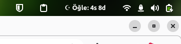
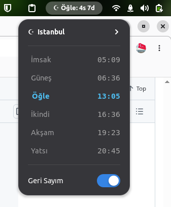

# 🕌 Namaz Vakti — GNOME Shell Extension

<p align="center">
  
  
</p>

Sağ üst panelde sıradaki namaz vaktine kalan süreyi geri sayım olarak gösteren bir GNOME Shell eklentisidir. **Diyanet İşleri Başkanlığı** vakitleriyle birebir uyumludur. **Süleyman Şişman tarafından insanlık yararına oluşturulmuştur. Pardus** sistemleriyle tam uyumludur.

[](https://extensions.gnome.org/)
[](https://www.gnu.org/licenses/gpl-3.0)
[](https://www.pardus.org.tr/)

---

## ✨ Özellikler

| Özellik | Açıklama |
|---------|----------|
| ☪ **Geri Sayım** | Sıradaki namaz vaktine kalan süre panelde gösterilir |
| 📋 **Açılır Menü** | Tıklayınca günün tüm vakitlerini listeler |
| 🔘 **ON/OFF Toggle** | Menüden tek tıkla açıp kapatabilirsiniz |
| 🏙️ **81 İl Desteği** | Türkiye'nin tüm illeri için vakit hesaplama |
| 💾 **Kalıcı Ayarlar** | Seçtiğiniz il reboot sonrası bile hatırlanır |
| ⚡ **Hafif** | Günde sadece 1 kez doğrudan Diyanet web sitesinden veri çeker |
| 📦 **Tek ZIP** | Kolay kurulum, kolay paylaşım |

## 🚀 Kurulum

### Yöntem 1: ZIP ile Kurulum (Önerilen)

```bash
# 1. Releases sayfasından ZIP'i indirin veya kendiniz oluşturun:
./build.sh

# 2. Kurun:
gnome-extensions install namaz_vakti_diyanet@sismans.zip

# 3. Oturumu kapatıp açın (Wayland zorunlu, X11'de Alt+F2 → r)

# 4. Etkinleştirin:
gnome-extensions enable namaz_vakti_diyanet@sismans
```

### Yöntem 2: Git'ten Manuel Kurulum

```bash
# 1. Repoyu klonlayın:
git clone https://github.com/sismans/pardus_gnome_namaz_vakti_diyanet.git
cd pardus_gnome_namaz_vakti_diyanet

# 2. ZIP paketini derleyin
./build.sh

# 3. Kurun:
gnome-extensions install namaz_vakti_diyanet@sismans.zip

# 4. Oturumu kapatıp açın

# 5. Etkinleştirin:
gnome-extensions enable namaz_vakti_diyanet@sismans
```

### Yöntem 3: GNOME Extensions Uygulamasından

Kurulumdan sonra **Uzantılar** (Extensions) uygulamasını açın → **Namaz Vakti** → Slider ile açın.

## ⚙️ Ayarlar

**İl değiştirmek için:**
Açılır menünün (Paneldeki eklenti simgesine tıklayınca açılır) en üstündeki Şehir ismine tıkladığınızda tüm iller listelenir. Tıklayıp anında ilinizi değiştirebilirsiniz.

## 🏗️ Proje Yapısı

```
pardus_gnome_namaz_vakti_diyanet/
├── metadata.json          # Eklenti kimliği ve GNOME sürüm uyumu
├── extension.js           # Ana eklenti kodu (geri sayım + menü + Diyanet veri kazıma)
├── prefs.js               # İsteğe bağlı ayarlar penceresi 
├── stylesheet.css         # Panel ve menü stili
├── schemas/
│   └── ...gschema.xml     # GSettings şeması (kalıcı il hatırlama)
├── build.sh               # ZIP paketleme scripti
├── LICENSE                # GPL-3.0
└── README.md              # Bu dosya
```

## 🔧 Teknik Detaylar

### Veri Kaynağı
- **Veri:** Doğrudan [Diyanet İşleri Başkanlığı Namaz Vakitleri](https://namazvakitleri.diyanet.gov.tr) sayfasından alınır.
- Herhangi bir API limiti, kota veya kimlik doğrulamasına takılmaz.
- **HTTP:** Soup3 asenkron çağrı (UI thread bloklanmaz)

### Zaman Hesaplama Algoritması

Tüm hesaplamalar **dakika modeline** dayanır:

```
T_güncel = (Saat × 60) + Dakika
T_hedef  = (VakitSaat × 60) + VakitDakika
ΔT = T_hedef - T_güncel

Tüm vakitler geçtiyse (yatsı sonrası):
  ΔT = (1440 - T_güncel) + T_imsak_ertesi
```

### Bellek Yönetimi
- `disable()` tüm timer, sinyal ve referansları temizler
- Bellek sızıntısı riski sıfır
- OFF durumunda CPU kullanımı sıfır

## 🐧 Pardus Uyumluluğu

Bu eklentiyi Pardus Yazılım Merkezi'ne önerebilirsiniz. Pardus (Debian tabanlı) sistemlerde yerli ve milli amaçlarla insanlık yararına test edilmiş ve geliştirilmiştir. Pardus Yazılım Merkezi'ne önermek için:

1. [Pardus Uygulama Öner](https://apps.pardus.org.tr/suggest) sayfasına gidin
2. **Uygulama Adı:** Namaz Vakti GNOME Extension
3. **Web Sitesi:** Bu GitHub reposunun URL'si [ https://github.com/sismans/pardus_gnome_namaz_vakti_diyanet/ ]

## 📋 Gereksinimler

- GNOME Shell 45 veya üzeri
- `libsoup3` (genellikle GNOME ile birlikte gelir)
- İnternet bağlantısı (günde 1 kez Diyanet verisi çekmek için)

## 🤝 Katkıda Bulunma

1. Bu repoyu fork edin
2. Yeni bir branch oluşturun (`git checkout -b ozellik/yeni-ozellik`)
3. Değişikliklerinizi commit edin (`git commit -m 'Yeni özellik ekle'`)
4. Branch'inizi push edin (`git push origin ozellik/yeni-ozellik`)
5. Pull Request açın

## 📄 Lisans

Bu proje [GNU General Public License v3.0](LICENSE) ile lisanslanmıştır.

## 👤 Geliştirici

**Süleyman Şişman**
